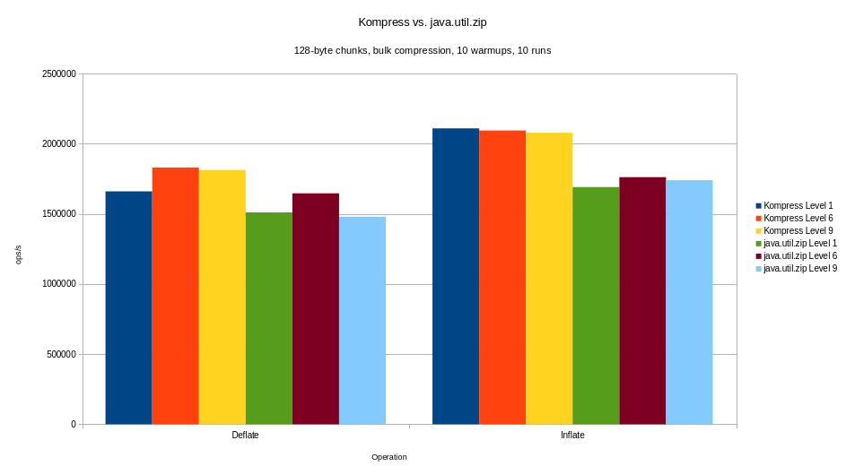

# 🗜️ Kompress

[](https://git.karmakrafts.dev/kk/kompress/-/pipelines)
[](https://git.karmakrafts.dev/kk/kompress/-/packages)
[](https://git.karmakrafts.dev/kk/kompress/-/packages)
[](https://kotlinlang.org/)
[](https://docs.karmakrafts.dev/kompress-core)

Compression and archiver APIs for Kotlin Multiplatform.

### Features

- **100% implemented in Kotlin common code!**
- Supports all Kotlin Multiplatform targets
- General purpose `Compressor` and `Decompressor` APIs for modeling streaming compressors
- General purpose `Archiver<E>` and `Unarchiver<E>` APIs for modeling streaming archivers
- Create and read various archive types, including GZIP and ZIP.
- Synchronous streaming API inspired by Java's `Inflater`/`Deflater` APIs
- Integration with [kotlinx.io](https://github.com/Kotlin/kotlinx-io)
- Customizable compression-level for supported (de)compressors

### Modules

- **kompress-core**: Core compression and CRC APIs, provides a common DEFLATE implementation
- **kompress-gzip**: Support for the GZIP archive container format
- **kompress-zip**: Support for the ZIP archive container format **(WIP)**
- **kompress-benchmarks**: Various benchmarks comparing Kompress implementations against platform references

### Performance

The following graph compares Kompress DEFLATE RAW performance against the standard JVM  
implementation provided by `java.util.zip`:



### How to use it

First, add the official Maven Central repository to your settings.gradle.kts:

```kotlin
dependencyResolutionManagement {
    repositories {
        maven("https://central.sonatype.com/repository/maven-snapshots")
        mavenCentral()
    }
}
```

Then add a dependency on the library in your root buildscript:

```kotlin
kotlin {
    sourceSets {
        commonMain {
            dependencies {
                implementation("dev.karmakrafts.kompress:kompress-core:<version>")
            }
        }
    }
}
```

Or, if you are only using Kotlin/JVM, add it to your top-level dependencies block instead.

### Inflater and Deflater interfaces

#### Bulk compression

If you just want to (de)compress one large blob of data, the `Deflater.deflate` and `Inflater.inflate` functions
are what you're probably looking for:

```kotlin
fun main() {
    val myData = "Hello, World! This is an important message."
    val compressedData = Deflater.compress(
        data = myData.encodeToByteArray(), raw = false, // Control if you want the gzip/pkzip header
        level = 9, // Control the compression level
        bufferSize = 1024 // Control the internal buffer size
    )
    val decompressedData = Inflater.decompress(
        data = compressedData, 
        raw = false, 
        bufferSize = 1024
    )
    println(myData == decompressedData.decodeToString())
}
```

#### Streaming compression

Streaming compression is what you want if your data exceeds a certain size,  
that size usually being the limit of the underlying runtime's array size.  
With Kompress, that limit is about 2.147GB because the index type of an array
in Kotlin is a signed integer.
Streaming allows you to split up the data into discrete chunks and compress those
chunks sequentially until you processed all the data.

You can either use the `Deflater` and `Inflater` interfaces from the core module manually:

```kotlin
fun main() {
    val deflater = Deflater(
        raw = false,
        level = 9,
        // ...
    )
    val outputBuffer = ByteArray(1024)
    while (deflater.needsInput) {
        if (!hasMoreInput) deflater.finish() // Signal that we are done compressing
        deflater.input = getInputChunk()
        while (!deflater.finished) {
            deflater.compress(outputBuffer) // Deflate data into the buffer
            copyChunkToSomeTarget(outputBuffer)
        }
    }
    deflater.close() // Always close Deflater/Inflater, it is recommended to use .use{}
}
```

Or you can use the recommended way of `kotlinx.io` wrappers:

```kotlin
fun main() {
    val buffer = Buffer()
    buffer.writeInt(42)
    buffer.writeFloat(4.20F)

    val compressedBuffer = Buffer()
    buffer.deflatingSource().use(compressedBuffer::transferFrom)

    val decompressedBuffer = Buffer()
    compressedBuffer.inflatingSource().use(decompressedBuffer::transferFrom)
}
```