# Benchmarks

### Inflate

The following graphs show decompression performance, also comparing it to various platform APIs.

    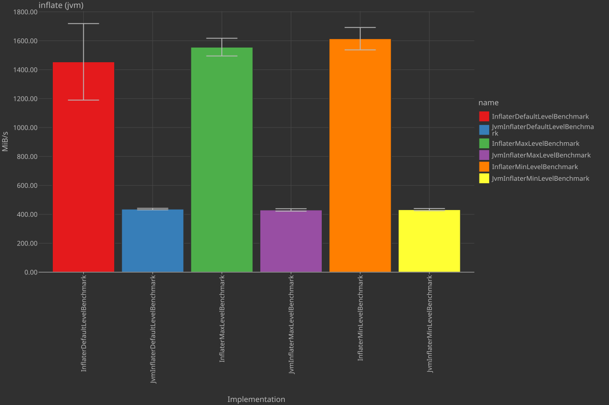
    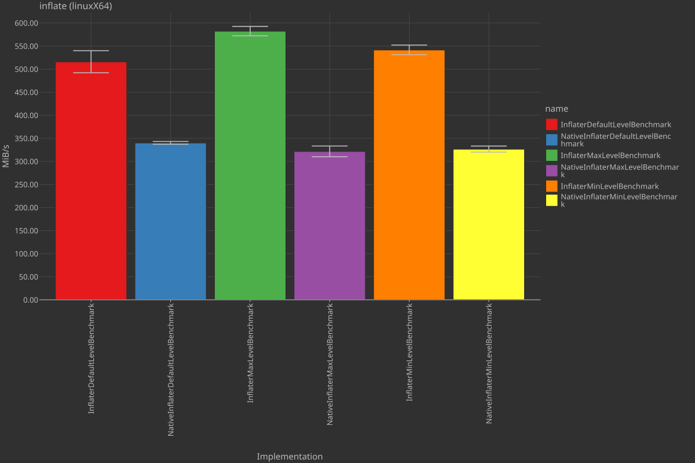

    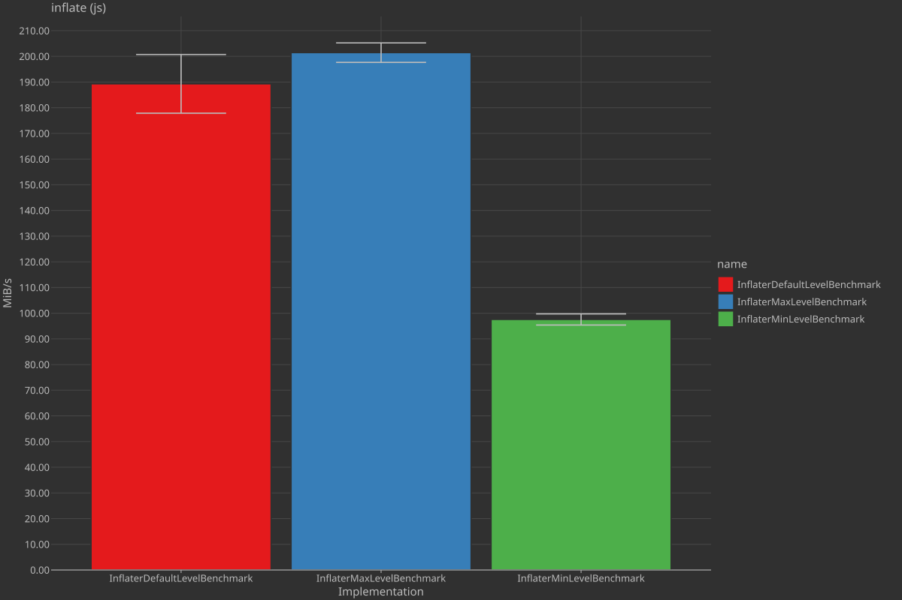
    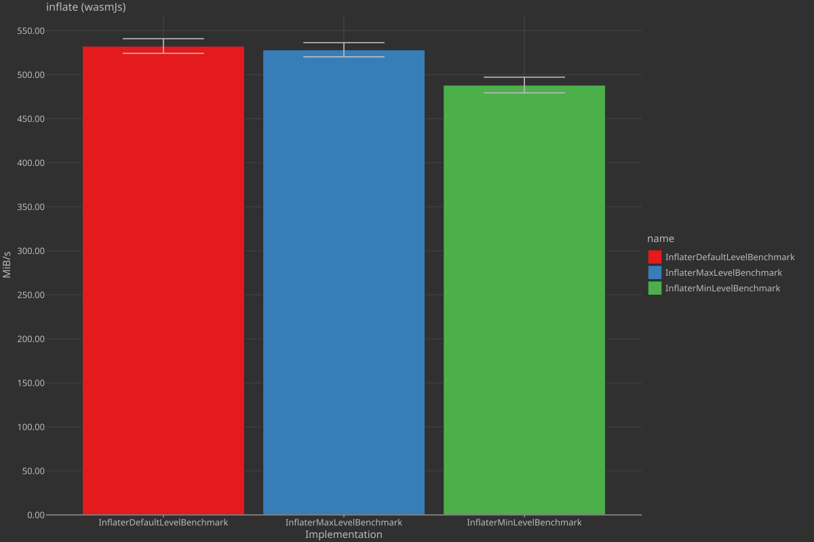

### Deflate

The following graphs show compression performance, also comparing it to various platform APIs.

    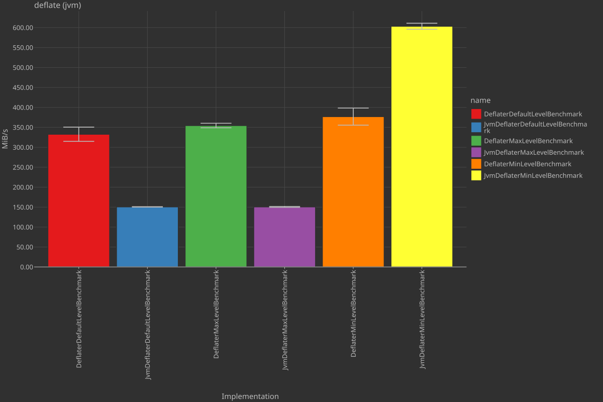
    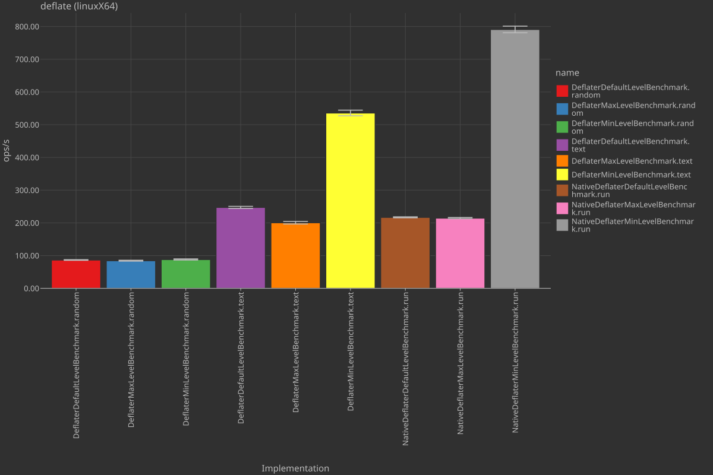

    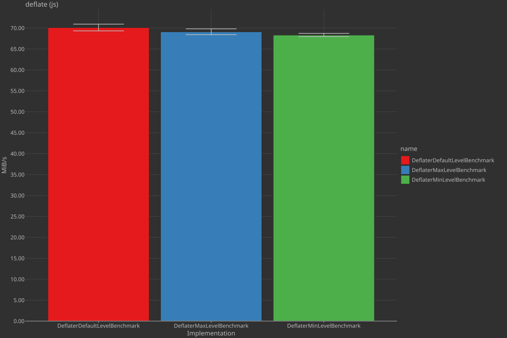
    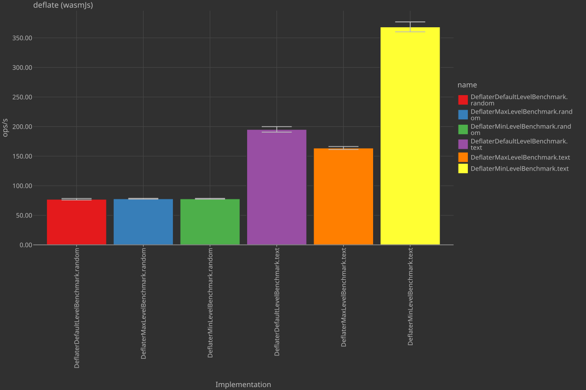

### Checksums

The following graphs show checksum computation performance, also comparing it to various platform APIs.

    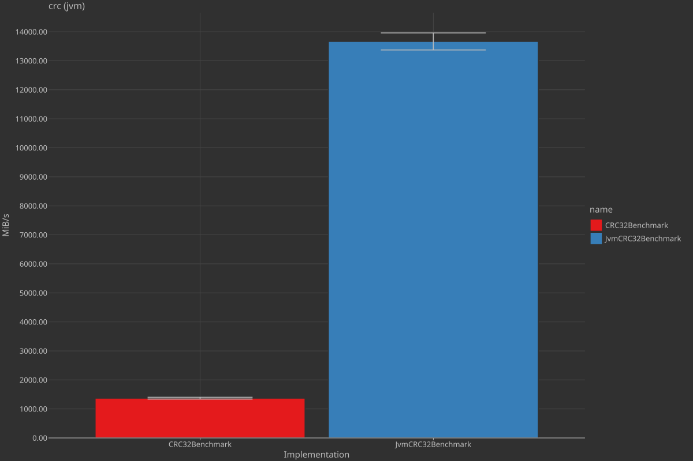
    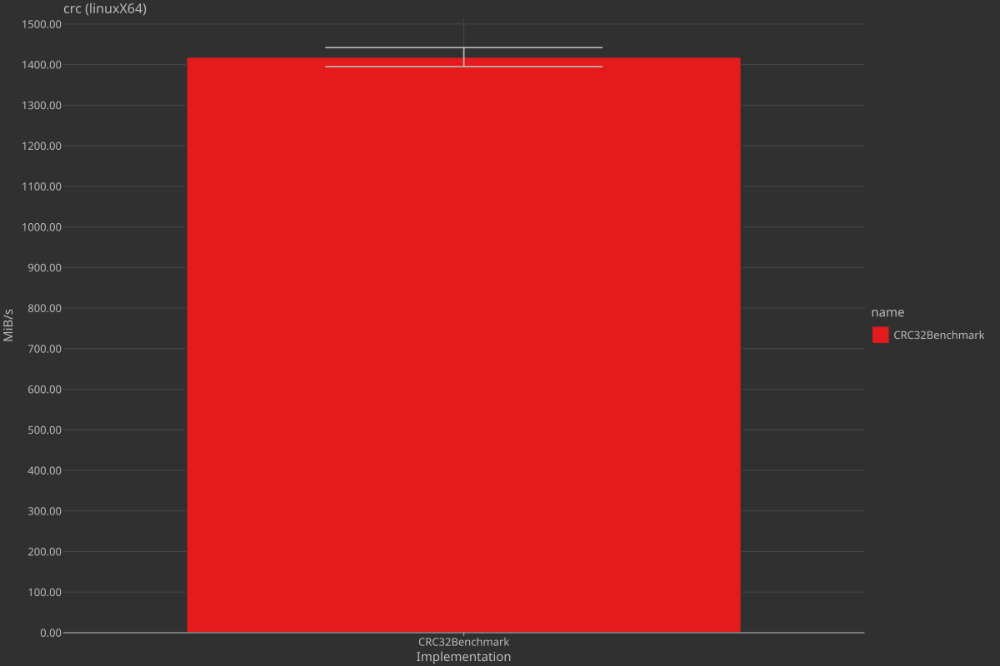

    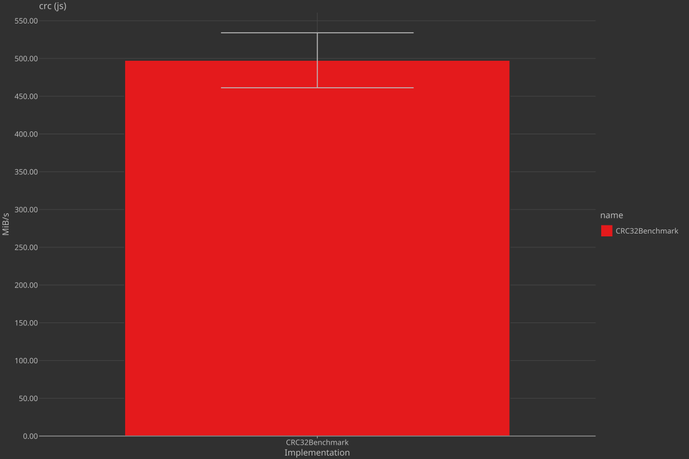
    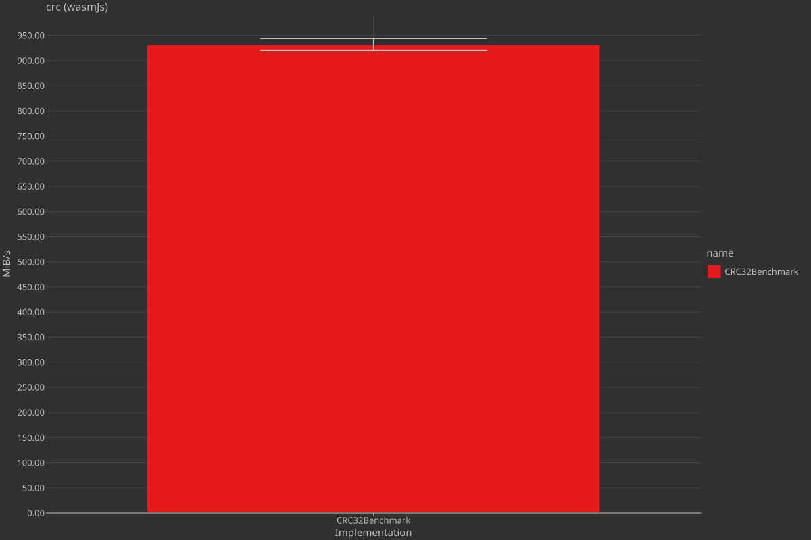

